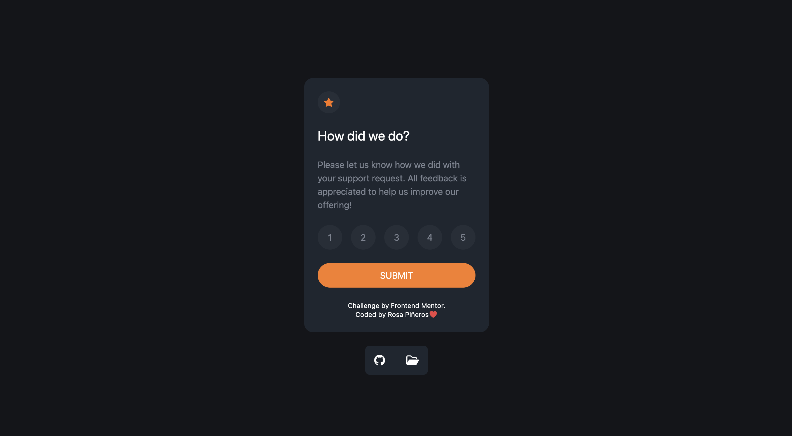

# Frontend Mentor - Interactive rating component solution

This is a solution to the [Interactive rating component challenge on Frontend Mentor](https://www.frontendmentor.io/challenges/interactive-rating-component-koxpeBUmI). Frontend Mentor challenges help you improve your coding skills by building realistic projects. 

## Table of contents

- [Overview](#overview)
  - [Screenshot](#screenshot)
  - [Links](#links)
  - [My process](#my-process)
  - [Built with](#built-with)
  - [Continued development](#continued-development)
  - [Useful resources](#useful-resources)
  - [Author](#author)

## Overview

### Screenshot

### Links

- Solution URL: [https://github.com/rosaSchutz/interactiveRatingComponent](https://github.com/rosaSchutz/interactiveRatingComponent)
- Live Site URL: [https://rosaschutz.github.io/interactiveRatingComponent/](https://rosaschutz.github.io/interactiveRatingComponent/)

## My process

### Built with

- HTML5
- Javascript
- Tailwindcss
- Flexbox
- Mobile-first workflow

### Continued development

Aprendí la diferencia entre hoover y focus, recordar nuevamente como hacer un botón redondo, cuando trato de recuperar un valor una lista de nodos tengo que usar el event.target.textContent, entendí un poco más las nodelist por un error que me dio (The error "buttonScore is not a function" is occurring because you're trying to use buttonScore as a function to add a click event listener to the buttons. However, buttonScore is actually a NodeList, which is a collection of DOM nodes. To fix this error, you need to loop over the NodeList and add the click event listener to each button individually. ).

### Useful resources

- [tailwindcss](https://tailwindcss.com/docs/width) -  Documentation tailwind.
- [mouse-events](https://es.javascript.info/mouse-events-basics) -  Documentation mouse events javascript.
- [image-object-fit](https://developer.mozilla.org/en-US/docs/Web/CSS/object-fit) -  Documentation image object-fit.

## Author

- Website - [Rosa Piñeros](https://portfolio-rosa-pineros.vercel.app/)
- Frontend Mentor - [@yourusername](https://www.frontendmentor.io/profile/rosaSchutz)